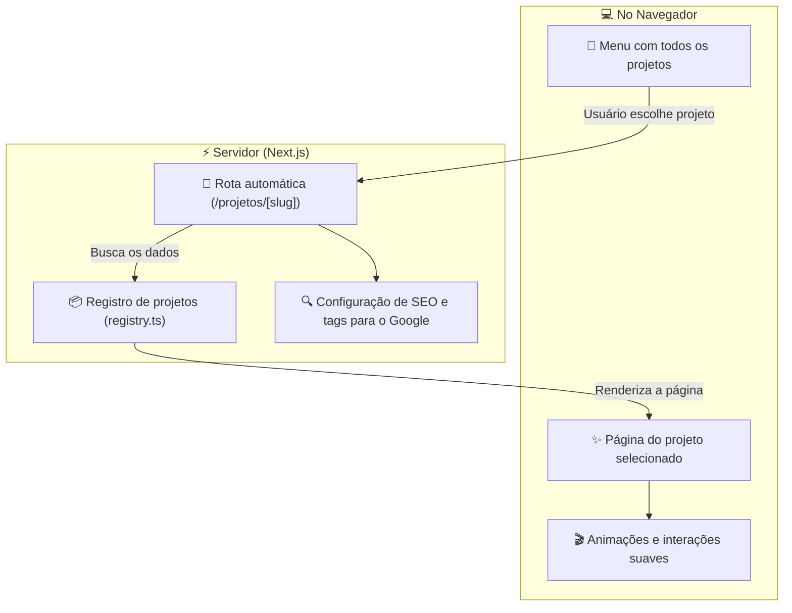

<div align="center">
  <br/>
  <br/>
  
</div>

<br />

## 🌟 Visão Geral

Este projeto é o meu **portfólio pessoal de landing pages**, criado para mostrar o desenvolvimento de sites modernos, interativos e muito bonitos. Ele funciona como uma vitrine de projetos reais e autorais criados para diversos segmentos (como restaurantes, clínicas, e-commerce, moda e tecnologia).

Em vez de usar modelos prontos ou copiar a mesma estrutura de sempre, cada landing page foi feita do zero. Cada uma tem seu próprio estilo visual, suas próprias fontes, cores e animações personalizadas para combinar perfeitamente com a proposta da marca.

## 🚀 Deploy & Demonstração

Você pode navegar e testar todas as páginas rodando online em:
👉 **[https://portfolio.magui.studio/](https://portfolio.magui.studio/)**

---

## 🛠️ Tecnologias Utilizadas

<div align="center">
  
  
  
  
  
  
  
  
  
</div>

---

## 🏛️ Como o Projeto Funciona

O site foi construído de forma inteligente para ser muito rápido para carregar e muito fácil de adicionar novos projetos. 



---

## 🎯 Detalhes e Diferenciais do Projeto

### ⚡ 1. Carregamento Instantâneo
* **Páginas pré-carregadas**: O Next.js gera as páginas no momento da publicação do site. Isso significa que quando alguém clica em um projeto, a página carrega na hora, sem demoras ou telas de carregamento travadas.
* **Imagens e fontes otimizadas**: As imagens são compactadas e convertidas de forma automática para os formatos mais leves (como WebP), e as fontes são carregadas direto do servidor para o site abrir rápido até em conexões lentas.

### 🔍 2. Feito para o Google (SEO)
* **Tags completas**: O site gera automaticamente os títulos, descrições e imagens corretas de compartilhamento para cada projeto individual.
* **Metadados inteligentes**: Uso de dados estruturados (JSON-LD) para que os robôs do Google entendam exatamente o conteúdo de cada página e mostrem o site de forma bonita nas pesquisas.

### 🛠️ 3. Organização e Código Limpo
* **Tudo em seu devido lugar**: Cada landing page tem sua própria pasta com seus próprios componentes, imagens e fontes exclusivas. Se precisar alterar algo em um projeto, você mexe apenas na pasta dele, sem o risco de quebrar o resto do site.
* **Botão de WhatsApp Inteligente**: O botão flutuante de contato sabe exatamente em qual página o usuário está e já envia uma mensagem personalizada com o nome do projeto/serviço que ele estava olhando.

---

## 📂 Estrutura de Pastas

```bash
src/
├── app/
│   ├── projetos/
│   │   └── [slug]/           # Rota que exibe cada landing page automaticamente
│   ├── page.tsx              # Página inicial do portfólio (Menu Principal)
│   └── globals.css           # Cores do site e reset de estilos
├── components/
│   ├── <projeto>/            # Pasta com os arquivos de cada landing page específica (header, hero, etc.)
│   ├── sections/
│   │   └── registry.ts       # Lista onde todos os projetos são cadastrados
│   └── whatsapp-button.tsx   # Botão dinâmico do WhatsApp
└── lib/
    └── seo.ts                # Configurações de SEO e compartilhamento do site
```

---

## 📑 Documentação Técnica Adicional

Para entender em detalhes a estrutura do projeto e as decisões de implementação, consulte a pasta [`/docs`](./docs/README.md):

- 🏗️ [**`docs/architecture.md`**](./docs/architecture.md): Organização de componentes, isolamento de assets e funcionamento da rota dinâmica.
- 🔍 [**`docs/seo.md`**](./docs/seo.md): Metadados dinâmicos e estrutura de dados JSON-LD para buscas no Google.

---

## 🏁 Como Rodar o Projeto Localmente

### 1. Clonar o repositório e instalar as dependências:

```bash
git clone https://github.com/gui-bus/MAGUI-Landing-Pages.git
cd MAGUI-Landing-Pages
pnpm install
```

### 2. Iniciar o servidor de desenvolvimento:

```bash
pnpm dev
```

Agora é só abrir [http://localhost:3000](http://localhost:3000) no seu navegador para ver o projeto funcionando localmente.
