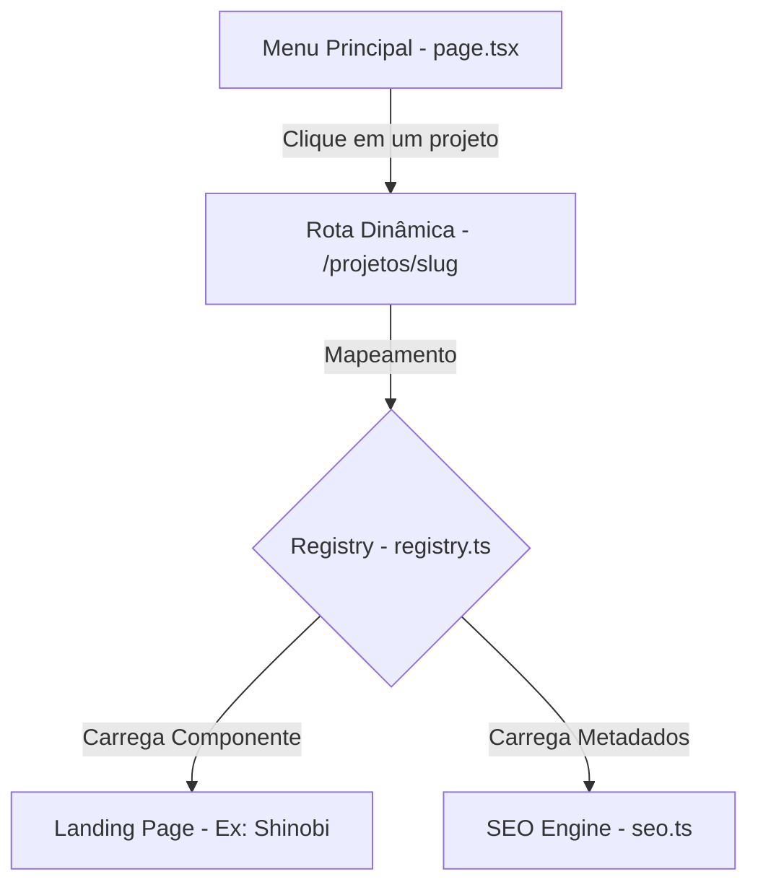

# 🏗️ Arquitetura e Estrutura de Pastas

Este documento explica como o portfólio de landing pages foi arquitetado de forma modular e eficiente.

---

## 🧭 Visão Geral

O projeto foi construído utilizando **Next.js** (App Router) e funciona de maneira totalmente estática. Todas as landing pages são compiladas durante o build do site para que o carregamento seja imediato (SSG - Static Site Generation).



---

## 🗂️ Organização das Landing Pages

Para manter o código sustentável e evitar conflitos visuais entre as landing pages, cada uma tem seu ecossistema 100% encapsulado em uma pasta própria:

```bash
src/components/
├── shinobi/            # Pasta exclusiva do projeto Shinobi
│   ├── header.tsx      # Header específico
│   ├── hero-section.tsx# Hero Section específica
│   ├── fonts.ts        # Fontes personalizadas da marca
│   └── index.tsx       # Componente principal que junta as seções
```

Dessa forma:
* **Estilos isolados**: Os estilos de uma página não interferem nas outras.
* **Fontes isoladas**: O arquivo `fonts.ts` carrega apenas as fontes que aquela marca de fato usa.
* **Manutenção simples**: Se precisar atualizar o texto ou o design da "Pulse", por exemplo, você altera apenas a pasta `/pulse/`.

---

## 📦 Sistema de Registro (`registry.ts`)

Todas as landing pages disponíveis no portfólio são cadastradas no arquivo `src/components/sections/registry.ts`. Esse arquivo exporta um mapa onde cada projeto possui:

* **slug**: O link final da URL (ex: `nacho-libre`).
* **component**: O componente principal importado da pasta do projeto.
* **metadados**: Título para SEO, descrição, categoria, tags e imagem de capa.

### Exemplo de Registro:

```typescript
export const sections: SectionEntry[] = [
  {
    index: "01",
    slug: "nacho-libre",
    title: "Nacho Libre",
    description: "Restaurante mexicano moderno com tacos, burritos e drinks.",
    category: "Landing Pages",
    cardImage: "/images/nacho-libre/project-cover.webp",
    industry: "Gastronomia",
    projectType: "Restaurante mexicano",
    seoTitle: "Nacho Libre | Restaurante mexicano moderno",
    seoDescription: "Landing page do Nacho Libre com cardápio dinâmico.",
    tags: ["Cardápio", "Pedidos", "Experiência de marca"],
    visible: true,
    component: Landing02NachoLibre, // Componente importado
  }
];
```
