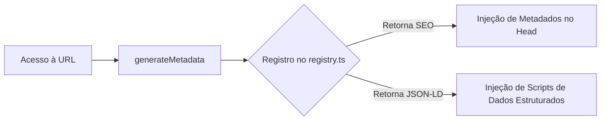

# 🔍 SEO & Metadados Dinâmicos

Este documento detalha como o projeto foi otimizado para que as landing pages apareçam de forma correta e atraente nos motores de busca (como o Google) e em compartilhamentos de redes sociais.

---

## 🚀 Como o Google Enxerga o Site

O Next.js processa a geração dos cabeçalhos `<head>` de forma automática no servidor. Criamos funções utilitárias em `src/lib/seo.ts` para que, ao acessar `/projetos/nacho-libre`, a página injete exatamente as informações cadastradas para aquele projeto.



---

## 📋 Funcionalidades de SEO Implementadas

### 1. Metadados Personalizados por Projeto
* **Título e Descrição**: Cada página carrega o título e a descrição de SEO específicos da marca.
* **Tags Open Graph & Twitter Card**: Garante que, ao compartilhar o link do projeto no WhatsApp, Slack, LinkedIn ou Twitter, o card de visualização exiba a imagem de capa correta do projeto (`project-cover.webp`).
* **Canonical URL**: Injeta a URL canônica exata para evitar qualquer punição do Google por conteúdo duplicado.

### 2. Dados Estruturados (JSON-LD)
Para ajudar os robôs de pesquisa a entenderem a semântica do site, injetamos scripts do tipo `application/ld+json` em tempo real:

* **Organization**: Identifica a entidade responsável pelo site.
* **CollectionPage / ItemList**: Informa que a página principal é um agrupado de projetos.
* **CreativeWork**: Classifica cada página de projeto como uma peça de trabalho criativa/portfólio, com autor, imagem, tags e descrição detalhados.
* **BreadcrumbList**: Facilita a navegação de hierarquia para os motores de busca (Ex: `Home > Projetos > Nacho Libre`).

---

## 🛠️ Exemplo de Implementação Técnica

Na rota dinâmica `src/app/projetos/[slug]/page.tsx`, a injeção do SEO e dos scripts JSON-LD é feita de forma simples e limpa:

```typescript
// Geração automática de metadados para a aba do navegador e redes sociais
export async function generateMetadata({ params }) {
  const { slug } = await params;
  const entry = sectionMap[slug];
  const baseUrl = await getRequestSiteUrl();

  return buildProjectMetadata(entry, baseUrl);
}

// Injeção de esquemas de dados estruturados na renderização
export default async function ProjectPage({ params }) {
  const { slug } = await params;
  const entry = sectionMap[slug];
  const baseUrl = await getRequestSiteUrl();

  return (
    <main>
      {/* Script para o Google */}
      <script
        type="application/ld+json"
        dangerouslySetInnerHTML={{
          __html: JSON.stringify(createProjectJsonLd(entry, baseUrl)),
        }}
      />
      
      {/* Componente da Landing Page */}
      <SectionComponent />
    </main>
  );
}
```
